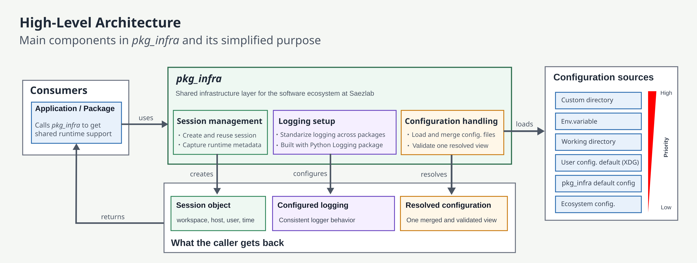

# Explanations

This section explains how `pkg_infra` is designed and why the package is
structured the way it is.

## Architecture overview

The following diagram shows the highest-level architecture of the current
solution. It is intentionally simplified so the main building blocks are easy
to understand before we zoom into runtime details.

At this level, `pkg_infra` can be understood as one package with three main
responsibilities:

- session management
- configuration handling
- logging setup

Once this overview feels right, we can add a second diagram for the internal
runtime flow.

## Configuration layering

The configuration system is designed to support shared defaults across an
ecosystem while still allowing local overrides. The implementation resolves
multiple config locations, merges the available files, and validates the final
result before exposing it to the rest of the package.

The effective precedence is:

1. Ecosystem config
2. Packaged default config
3. User config
4. Working-directory config
5. Config file referenced by `PKG_INFRA_CONFIG`
6. Explicit custom path passed by the caller

For the shipped baseline structure, see
[Default schema and baseline configuration](default-schema.md).

For a practical guide to writing override files, see
[Writing and Overriding Configuration](../guides/config-overrides.md).

## Session lifecycle

The session is a process-wide singleton managed by `SessionManager`. The first
call to `get_session(...)` performs initialization work and creates a frozen
`Session` instance. Later calls reuse that object, which keeps downstream code
simple and avoids repeated reconfiguration.

Location lookup is intentionally lazy. It is only attempted if enabled and only
performed when `session.location` is accessed.

## Logging model

The logging layer standardizes how downstream packages receive configured
loggers. It translates the merged configuration into a validated `dictConfig`
payload, prepares file handler paths, and supports package-group based policy
resolution.

This lets the package ecosystem share conventions without replacing the Python
`logging` module itself.
