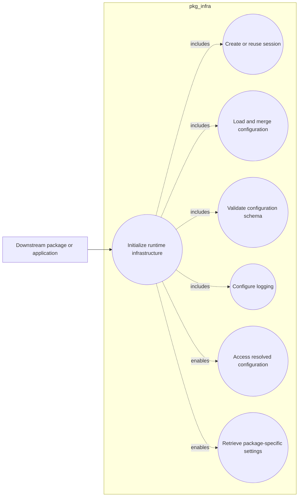

# Use Cases

## General use case

The most general use case in this project is:

> A downstream package or application uses `pkg_infra` to initialize shared
> runtime infrastructure for its execution context.

This includes session creation, configuration loading, configuration
validation, logging setup, and access to package-specific settings.

At a high level, the package is not just offering isolated helpers. It is
primarily offering one integrated capability: provide a standardized runtime
foundation for packages in the ecosystem.

## Standardize startup behavior across packages

A downstream package can call `pkg_infra.get_session(...)` during its startup
path to initialize configuration, logging, and runtime metadata in one step.

## Share logging policies across an ecosystem

Packages that belong to the same ecosystem can share logger levels, handlers,
and output behavior through common configuration rather than each package
carrying separate logging bootstrap code.

## Override defaults locally without changing packaged settings

Users and developers can adapt behavior with user-level, working-directory,
environment, or explicit custom config files while preserving a packaged
baseline configuration.

## Expose package-specific integration settings

Downstream libraries can store their own settings under the `integrations`
section and retrieve them with `session.get_conf(...)` without needing a custom
loader for each package.
